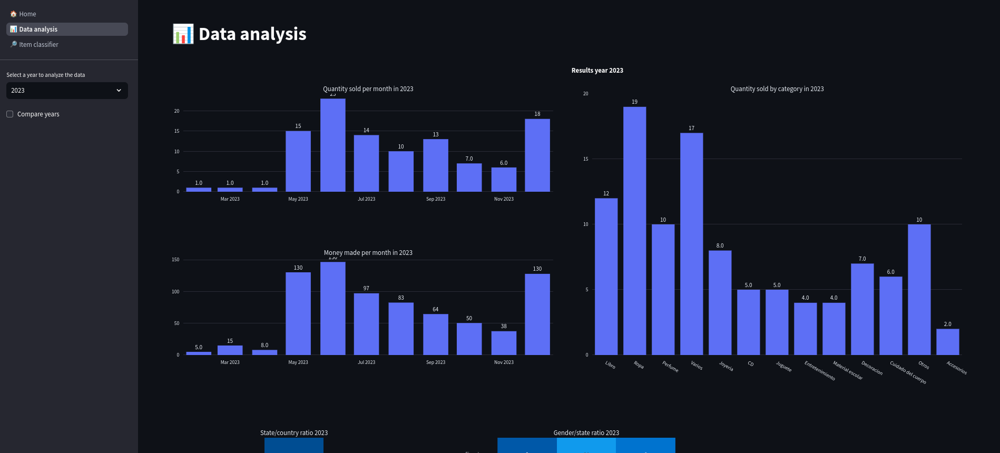
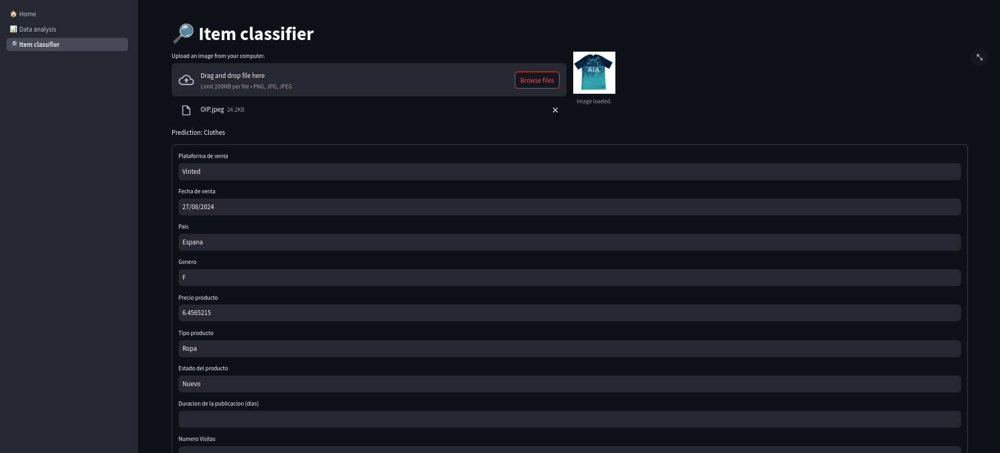

# 📊 Streamline Sales Suite

<table align="center">
  <tr>
    <td></td>
    <td></td>
  </tr>
</table>

## **📄 Overview**

Streamline Sales Suite is a comprehensive platform designed for data analysis and visualization, powered by Python and advanced deep learning techniques. This suite includes a Convolutional Neural Network (CNN) model tailored for item classification, enabling precise categorization and insightful data analysis.

## **🚀 Getting Started**

To set up and use this repository, follow these steps:

1. **Clone the Repository:**
   ```bash
   git clone <repository_url>
   ```

2. **Install Poetry (if not already installed):**
   ```bash
   pip install poetry
   ```

3. **Install Dependencies:**
   Set up the Python virtual environment and install all necessary dependencies:
   ```bash
   poetry install
   ```

4. **Acquire Training Images:**
   Obtain the images required to train the classification model:
   ```bash
   poetry run python ./src/data_acquisition.py
   ```

5. **Train the Classification Model:**
   Train the CNN model with the acquired images:
   ```bash
   poetry run python ./src/training_model.py
   ```

6. **Run the Application:**
   Launch the complete project using Streamlit:
   ```bash
   poetry run streamlit run ./src/1_🏠_Home.py
   ```

7. **Docker Deployment:**
   A Dockerfile and Docker Compose are included for containerizing the application, which is particularly useful for deployment after the model is trained.

**Note:** The data analysis component relies on a private dataset and may not be functional without it. However, the project can be adapted to work with other datasets.

## **🔧 Technologies Used**

- **Streamlit:** For building and deploying the interactive web application.
- **Docker:** To containerize the application for easy deployment.
- **Poetry:** For dependency management and virtual environment setup.
- **Black:** To maintain consistent code formatting.
- **Pandas & NumPy:** For handling data processing and ETL tasks.
- **Loguru:** For efficient logging and monitoring of application processes.
- **TensorFlow & Keras:** For developing and training the deep learning model.
- **MLflow:** For tracking and managing the machine learning lifecycle.
- **OpenCV:** For image processing tasks.

## **🌟 Contributing**

Contributions are highly encouraged! Whether you have new tools, models, or techniques to share, your input is welcome. Please feel free to submit a pull request or open an issue to discuss your ideas.

## **🤖 License**

This project is licensed under the MIT License, allowing you to freely use, modify, and distribute the code.

## **🖥️ GPU Support with Nvidia Container Toolkit**

To utilize Nvidia GPUs within Docker, follow these steps:

1. Ensure that the Nvidia drivers are installed on your host machine.
2. Install the Nvidia Container Toolkit by following the [official guide](https://docs.nvidia.com/datacenter/cloud-native/container-toolkit/latest/install-guide.html#).
3. Restart Docker to apply the changes:
   ```bash
   sudo systemctl restart docker
   ```
4. Verify the GPU setup with the following command:
   ```bash
   sudo docker run --rm --gpus all nvidia/cuda:11.0.3-base-ubuntu20.04 nvidia-smi
   ```
5. Build the Docker image for the project:
   ```bash
   sudo docker build -t SLS-TF-image -f tensorflow.dockerfile .
   ```
6. Run the Docker container:
   ```bash
   sudo docker run --gpus all -p 8501:8501 --name SLS-TF-container SLS-TF-image
   ```